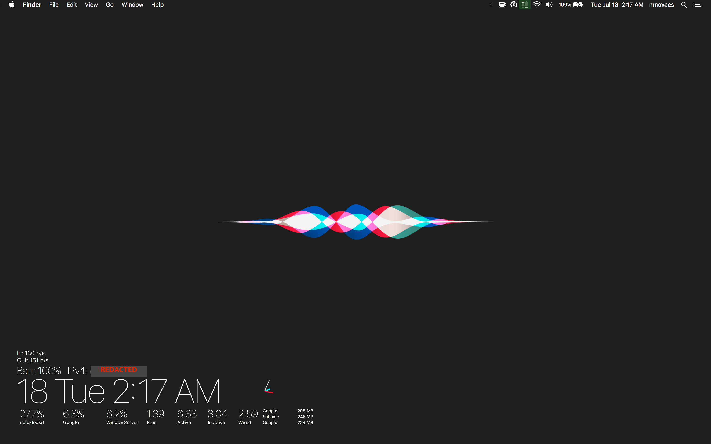

# UberDash for macOS

A customizable desktop dashboard for macOS.

Runs on top of [Übersicht](http://tracesof.net/uebersicht/) ([GitHub](https://github.com/felixhageloh/uebersicht)).

Bundled and modified select pieces from the [Übersicht widgets repository](https://github.com/felixhageloh/uebersicht-widgets).

## Getting started

Download and run Übersicht, replace its `widgets` directory with the one contained in this repository. 

## Roadmap

More to come in terms of widgets, customizations, polish.

Interested? Issues and PRs welcome
